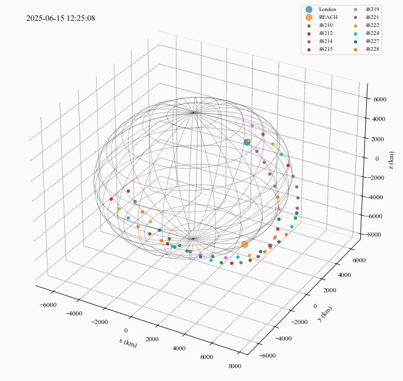

# astrotrack: Characterising LEO Satellite RFI in Wide-Field Radio Astronomy

 

## Overview

`astrotrack` is an open-source Python package for characterising potential Low Earth Orbit (LEO) satellite interference in wide-field radio astronomy observations. While interferometric arrays are able to spatially localise LEO satellite radiation, wide-beam radiometers like REACH (de Lera Acedo et al. 2022) integrate the total sky power into a frequency spectrum and therefore lack equivalent strategies for identifying satellite-generated contamination. To address this limitation, `astrotrack` provides tools for combining Two-Line Element (TLE) data with site-specific observational constraints to identify LEO satellite flyovers and investigate their potential association with radio frequency interference (RFI).

> **Accompanying Paper**: *'astrotrack: Characterising LEO Satellite Interference in Wide-Field Radio Astronomy'*, in preparation.

<br>
<div align="center">
  
  <p><em>3-D trajectory animation generated by AstroTrack's <code>satcon_animate</code> module of Eutelsat OneWeb satellite flyovers at the REACH site in the Karoo radio reserve, South Africa on 15 June 2025.</em></p>
</div>
<br>

## Repository Structure

| Paths | Description |
| ----- | ------------|
| [`data/`](data/) | CSV horizon profiles, including a [baseline](data/horizon-profiles/baseline-horizon.csv) and [REACH radiometer](data/horizon-profiles/REACH-horizon.csv) horizon profile. Alongside this, the [TLE catalogue](data/TLE-catalogues/TLEs.txt) used in exemplar and experimental analyses is provided. |
| [`docs/`](docs/) | [Example usage](docs/examples/) of functionalities across `astrotrack` modules. |
| [`astrotrack/`](astrotrack/) | `astrotrack` Python package source code.  |
| [`notebooks/astrotrack_demo/`](/notebooks/astrotrack_demo/) | [Demonstration notebook](notebooks/astrotrack_demo/01_astrotrack_demo.ipynb) showing example `astrotrack` workflow. |
| [`notebooks/astrotrack_results/`](notebooks/astrotrack_results/) | Notebooks documenting experimental results and analyses. |
| [`tests`](tests/) | Unit tests validating `astrotrack` functionalities and edge case performance.|
| [`environment.yml`](environment.yml) | Conda environment for `astrotrack` specifying required dependencies.|


## Data Availability

Raw HDF5 files containing PSD observations used for comparison are proprietary to the REACH collaboration and are therefore not made publicly available. The publicly available 12,270 TLEs used in this work are provided in a [CSV file](data/TLE-catalogues/TLEs.txt) downloaded from [Space-Track](https://www.space-track.org) on 17:10:37 UTC 14 June 2025.


## `astrotrack` Installation

To install `astrotrack` from source, follow the instructions below:

```bash
conda env create -f environment.yml
conda activate astrotrack
pip install -e .
```

The package can then be imported using:

```bash
import astrotrack
```

`astrotrack` is recommended to be used with the provided Conda [environment](environment.yml).


## Quick Start

The below example demonstrates how to initialise `astrotrack` using a provided TLE catalogue along with user-defined observational constraints, the satellite constellation of interest, and a target date:

```python
from datetime import datetime
from astrotrack.preprocess import load_satellite_data

data = load_satellite_data(
    tle_file="LEO_TLE_file.txt",
    target_date=datetime(2025, 1, 18, 12, 25, 8),
    obs_len=3600, 
    traj_res=60,
    obs_lat=51.5,
    obs_lon=-0.1,
    R=2000,
    horizon_data="Horizon-Profile.csv", 
    satcon="STARLINK"
)
```

> **Generating Epoch Times with Skyfield**: The following code can be used to initialise a time array for satellite propagation.
>
>```python
>import numpy as np
>from skyfield.api import load
>
># Create a timescale object:
>ts = load.timescale()
>
># Define orbit duration:
>orbit_duration = np.arange(0, 3600, 1)  # in seconds
>
># Generate time array:
>epochs_of_orbit = ts.utc(2025, 1, 1, 10, 15, 0 + orbit_duration)
>```
>


## Example Usage & Workflow

`astrotrack` is organised into five modules. A typical workflow begins with initialising and structuring satellite Two-Line Element (TLE) data for analysis, after which the subsequent modules derive orbital properties, Doppler behaviour with respect to a ground-based experiment, animations, and enable spectral associations.

<br>
<div align="center">
  
</div>
<br>

- [`preprocess`](): Loads and filters satellite TLE data provided by the user.
- [`satcon_properties`](): Filters, analyses, and visualises satellite trajectories as well as their metrics. 
- [`doppler_analysis`](): Evaluates Doppler shifts and detectability relative to a user-defined instrument's specifications.
- [`satcon_animate`](): Generates 3-D trajectory animations.
- [`psd_analysis`](): Visualises satellite flyover properties alongside measured PSD data coincidential with satellite flyovers.

A detailed overview of all five modules, their key functions, and example usage is provided in a supplementary [document](docs/examples/examples.md).


A [demonstration notebook](notebooks/astrotrack_demo/01_astrotrack_demo.ipynb) is also provided, and includes usage of an example [horizon profile](data/horizon-profiles/REACH-horizon.csv) from the REACH experiment as well as a [TLE catalogue](data/TLE-catalogues/TLEs.txt) compiled from [Space-Track](https://www.space-track.org). A [baseline horizon profile](data/horizon-profiles/baseline-horizon.csv) corresponding to an idealised flat horizon is additionally available to be used directly, or modified by the user to incorporate site-specific observational constraints.

## Testing \& Validation

`astrotrack` is validated using unit tests covering the package's functionalities from [TLE preprocessing](tests/preprocess_test.py), deriving [satellite properties](tests/satcon_properties_test.py), performing [Doppler Analysis](tests/doppler_analysis_test.py), and analysis with [PSD observations](tests/psd_analysis_test.py).

The entire test suite can be run using:
```bash
pytest
```

## License

The `astrotrack` Python package source code is released under BSD 3-Clause License, with citation details provided in the [`CITATION.cff`](CITATION.cff) file.

## Bibliography

de Lera Acedo, E., de Villiers, D.I.L., Razavi-Ghods, N. et al. *The REACH radiometer for detecting the 21-cm hydrogen signal from redshift z ≈ 7.5–28*. Nat Astron 6, 984–998 (2022). https://doi.org/10.1038/s41550-022-01709-9